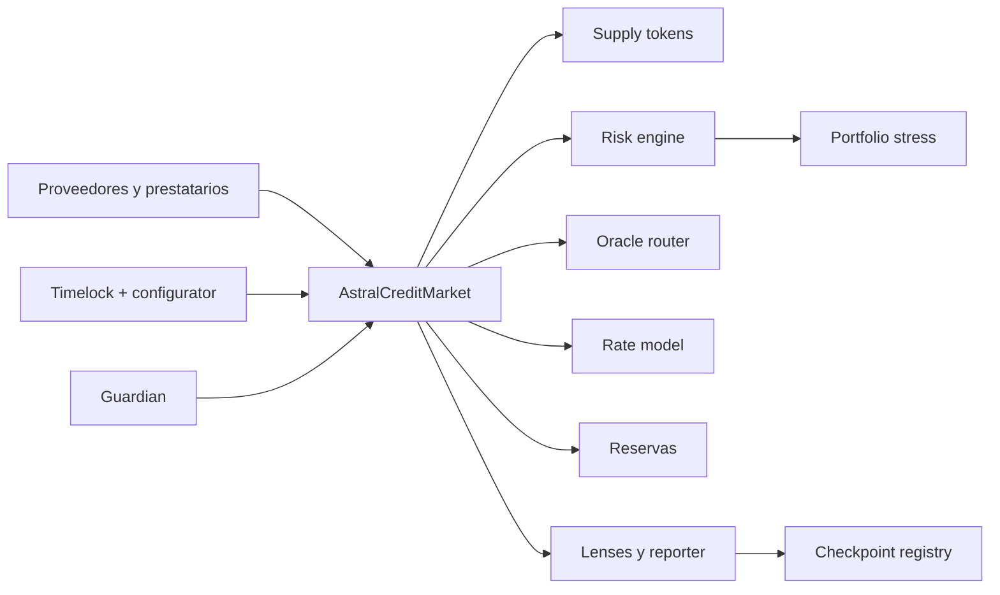
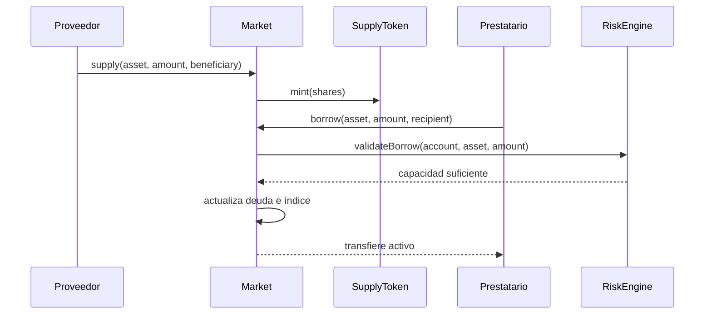

# AstralCreditProtocol


AstralCreditProtocol es un mercado de crédito multi‑activo para EVM. Combina
vaults con shares, deuda variable indexada, precios normalizados, liquidaciones
parciales, reservas, gobierno diferido y una capa de observabilidad diseñada
para operadores e integradores.

[](https://github.com/SolguardLabs/AstralCreditProtocol/actions/workflows/ci.yml)
[](https://github.com/SolguardLabs/AstralCreditProtocol/actions/workflows/release-integrity.yml)


## Arquitectura



El mercado principal mantiene custodia y contabilidad. El motor de riesgo lee
posiciones y precios para validar borrow, reducción de colateral y saneamiento.
Los componentes de gobierno, monitorización y simulación permanecen separados
de las rutas que transfieren activos.

## Capacidades

- mercados aislados por activo con `supplyCap` y `borrowCap`;
- shares ERC‑20 que representan la participación en cada vault;
- deuda individual actualizada contra un índice global en ray;
- curva de tipos de dos pendientes y factor de reserva;
- precios con normalización de decimales, frescura y fallback;
- health factor agregado entre mercados;
- saneamiento parcial con close factor e incentivo dinámico;
- pausa global, congelación por mercado y roles diferenciados;
- cambios de configuración en lote y cola temporal;
- stress multi‑mercado con shocks, HHI y correlación;
- checkpoints contables hash‑linked con aprobación por quórum;
- SDK TypeScript sin dependencias de ejecución.

## Componentes

| Ruta | Responsabilidad |
| --- | --- |
| `src/AstralCreditMarket.sol` | Custodia, supply, withdraw, borrow, repay, intereses y saneamiento |
| `src/risk/` | Riesgo de cuenta, políticas y stress de cartera |
| `src/oracle/` | Enrutamiento, normalización, fallback y sentinel |
| `src/interest/` | Curva variable por utilización |
| `src/governance/` | Configuración agrupada y timelock |
| `src/security/` | Registro de checkpoints con quórum |
| `src/lens/` | Vistas de cuenta, mercado y capacidad |
| `src/treasury/` | Recepción y distribución de reservas |
| `sdk/` | Lecturas tipadas y cálculos operativos en bigint |
| `script/` | Despliegue de núcleo y capa operativa |

## Modelo económico

Para cash `C`, deuda `D` y reservas `R`, la utilización es:

```text
U = D / (C + D - R)
```

El tipo de borrow usa una curva de dos pendientes. Por debajo del punto óptimo:

```text
r_b = base + slope₁ · U / U_opt
```

Por encima del óptimo añade `slope₂` sobre el exceso. La deuda de una cuenta se
actualiza con el índice global:

```text
debt_now = principal · borrow_index_now / position_index
```

El health factor agrega valor de colateral ponderado por umbral y valor de deuda:

```text
HF = liquidation_collateral_value / debt_value
```

Consulta [el modelo económico](./docs/modelo-economico.md) para unidades,
redondeos, stress y ejemplos.

## Flujo de crédito



## Inicio rápido

Requisitos: Foundry `1.7.1`, `forge-std` `1.16.2` y Node.js `24`.

```bash
forge install foundry-rs/forge-std@v1.16.2 --no-git --shallow
bash scripts/ci.sh
```

En PowerShell, con `forge` disponible en `PATH`:

```powershell
.\scripts\ci.ps1
```

La validación ejecuta formato, compilación Solidity `0.8.24`, perfil Foundry
con fuzz reforzado, 33 pruebas funcionales y controles del artefacto público.

## SDK

```typescript
import { AstralCreditClient, keeperPlan } from "./sdk/AstralCreditClient.ts";

const client = new AstralCreditClient(transport, marketAddress, riskEngineAddress);
const count = await client.marketCount();
const plan = keeperPlan(80, 4_000_000n, 80_000n, 1_000_000n, 250_000n);
console.log({ count, batch: plan.batchSize, deployable: plan.deployableCash });
```

El SDK sólo efectúa lecturas y cálculos deterministas. La firma, simulación y
difusión de transacciones corresponden a la aplicación integradora.

## Documentación

- [Arquitectura](./docs/arquitectura.md)
- [Modelo económico](./docs/modelo-economico.md)
- [Modelo de seguridad](./docs/modelo-seguridad.md)
- [Gobierno](./docs/gobierno.md)
- [Operaciones](./docs/operaciones.md)
- [Integración](./docs/integracion.md)
- [Despliegue](./docs/despliegue.md)

## Versión

`v1.0.0` fija Solidity `0.8.24`, Foundry `1.7.1`, forge‑std `1.16.2` y
Node.js `24`. Las direcciones de cada red deben publicarse en un manifiesto
firmado y verificarse antes de cualquier integración.

## Licencia

[MIT](./LICENSE) © 2026 SolguardLabs.
