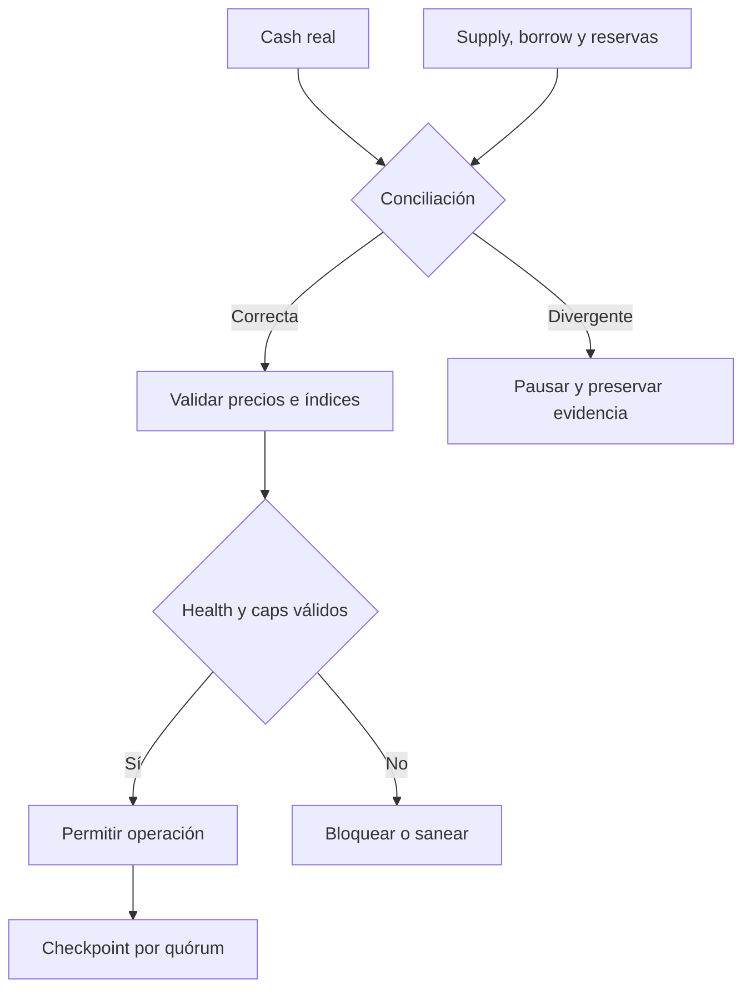

# Política de seguridad

AstralCreditProtocol aplica defensa por capas a custodia, solvencia, oráculos,
gobierno y operación. Los despliegues deben mantener roles separados, límites
de mercado explícitos y monitorización independiente de los saldos contables.

## Versiones mantenidas

| Versión | Estado |
| --- | --- |
| `1.0.x` | Mantenida |
| `< 1.0.0` | Sin mantenimiento |

## Superficie incluida

Contratos en `src/`, scripts de `script/`, SDK, CI y parámetros documentados.
Quedan fuera contratos modificados por terceros, credenciales externas,
frontends no incluidos y disponibilidad de proveedores RPC sin efecto on‑chain.

## Invariantes críticas

- `totalBorrowAssets` no debe superar el cap de deuda.
- `totalSupplyAssets` no debe superar el cap de suministro.
- las reservas no se consideran liquidez disponible para usuarios;
- ningún precio con edad superior a `priceMaxAge` autoriza una transición;
- los índices globales sólo avanzan y usan ray;
- una reducción de colateral debe conservar capacidad suficiente;
- el timelock sólo ejecuta payloads dentro de su ventana;
- un checkpoint final enlaza el hash anterior y reúne el quórum vigente.

## Gestión de incidentes

1. Registrar red, bloque, configuración, balances e índices.
2. Aplicar pausa global o congelación por mercado según el alcance.
3. Detener cambios de parámetros y conservar operaciones pendientes.
4. Comparar cash, supply, borrow, reservas y último checkpoint.
5. Preparar cualquier cambio mediante timelock y simulación reproducible.
6. Reanudar tras checkpoints consecutivos conciliados.

## Comunicación privada

Usa la pestaña **Security** del repositorio. No publiques detalles técnicos en
issues. Incluye versión, red, bloque, condiciones previas, impacto económico,
secuencia mínima y trazas relevantes. No adjuntes claves ni datos personales.

El equipo acusará recibo en un máximo de 72 horas y comunicará la evaluación
inicial en siete días naturales. La coordinación posterior depende del alcance,
reproducibilidad y medidas operativas disponibles.

Consulta [el modelo de seguridad](./docs/modelo-seguridad.md) y
[el runbook operativo](./docs/operaciones.md).
