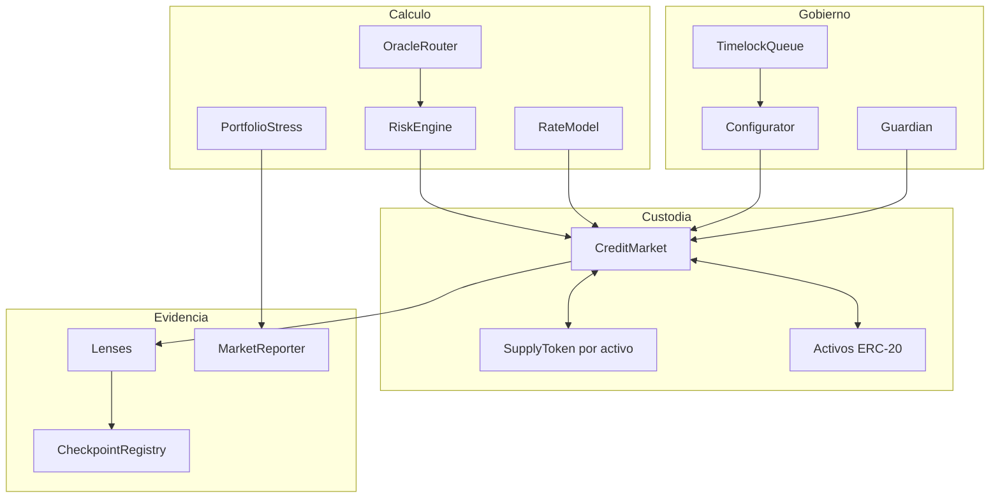

# Arquitectura

## Dominios

Astral distribuye responsabilidades en cuatro dominios: custodia, cálculo,
gobierno y evidencia. Sólo `AstralCreditMarket` mueve activos de usuarios.
Tokens de supply, oráculos, modelos de tipos y motor de riesgo aportan datos o
validaciones mediante interfaces acotadas.

## Estado de mercado

`MarketConfig` fija oráculo, curva, caps, factores, decimales y estado.
`MarketState` mantiene activos suministrados, deuda, reservas, índices y último
accrual. La deuda individual almacena principal e índice de referencia.

## Fronteras de confianza

| Componente | Confía en | Verificación exigida |
| --- | --- | --- |
| Market | Token ERC‑20 | Diferencia exacta de balance al recibir |
| RiskEngine | Market y oráculo | Precio válido, fresco y normalizado |
| OracleRouter | Feeds | Rango, edad, decimales y fallback |
| Timelock | Configurador | Hash de payload, ETA y expiración |
| Checkpoints | Reporters | Roles, quórum, orden y hash previo |
| SDK | Transporte | Dirección y forma de respuesta |

Owner, configurator, guardian, treasury, oracle publisher y reporters deben ser
identidades independientes. El admin debe residir en una política multifirma.
