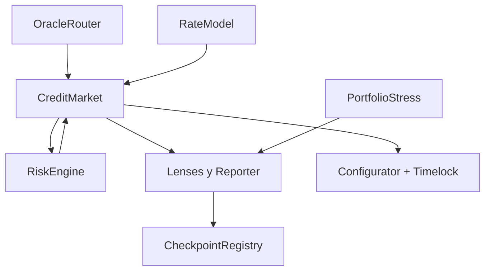

# Despliegue

## Fases



El script `DeployAstral.s.sol` despliega el núcleo. Tras verificar sus
direcciones, `DeployAstralOperations.s.sol` despliega timelock, stress,
checkpoints y superficies de lectura.

## Variables

```text
PRIVATE_KEY
ASTRAL_TREASURY
ASTRAL_MARKET
ASTRAL_RISK_ENGINE
ASTRAL_TIMELOCK_DELAY
ASTRAL_TIMELOCK_GRACE
ASTRAL_CHECKPOINT_QUORUM
```

## Comandos

```bash
forge script script/DeployAstral.s.sol:DeployAstral --rpc-url "$RPC_URL"
forge script script/DeployAstralOperations.s.sol:DeployAstralOperations --rpc-url "$RPC_URL"
```

Añade `--broadcast` únicamente después de simular y revisar el diff de estado.

## Manifiesto

Publica chain ID, bloque, direcciones, bytecode, argumentos, roles, parámetros,
commit y tag. Verifica código fuente y transfiere admin al gobierno antes de
habilitar mercados. El tag, `main` y `production` deben señalar el mismo commit.
