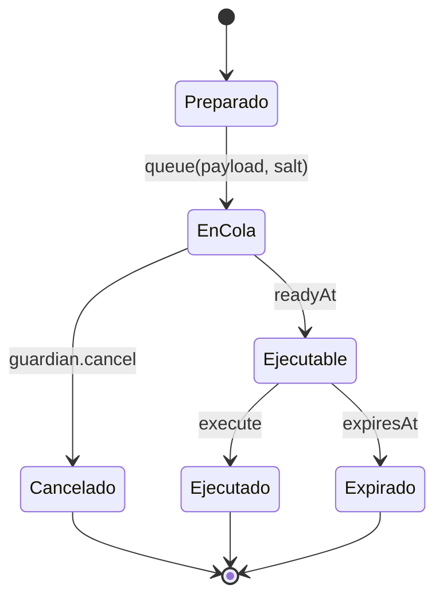

# Gobierno

## Ciclo de un cambio

El ID compromete target, value, hash del calldata y salt. `execute` reconstruye
el mismo ID, verifica el payload y sólo llama dentro de la ventana.

## Cambios gestionados

- caps de supply y borrow;
- LTV, umbral, incentivo, reservas y close factor;
- estado activo o congelado;
- fuentes de precio y modelo de tipos;
- rotación de treasury y roles;
- reporters y quórum contable.

## Procedimiento

1. Tomar snapshot y ejecutar stress base/adverso.
2. Preparar calldata y salt únicos.
3. Simular contra el estado vigente.
4. Publicar hash, ETA, expiración y métricas esperadas.
5. Encolar mediante identidad configurator.
6. Repetir simulación tras la ETA.
7. Ejecutar y emitir checkpoint de la época operativa.

El guardian puede cancelar, congelar mercados y activar la pausa, pero no debe
poseer la identidad que ejecuta cambios ordinarios.
