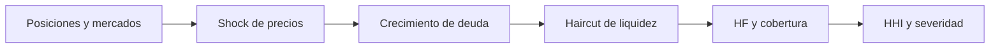

# Modelo económico

## Precisión

Los importes usan decimales nativos, los precios se normalizan a WAD, los tipos
e índices usan ray y los parámetros porcentuales usan puntos básicos.

```text
WAD = 10¹⁸
RAY = 10²⁷
BPS = 10.000
```

## Supply y shares

El primer depósito emite shares 1:1 en unidades nativas. Después:

```text
shares = assets · totalShares / totalSupplyAssets
assets = shares · totalSupplyAssets / totalShares
```

Los depósitos redondean hacia abajo y las retiradas calculadas por assets
redondean shares hacia arriba para no socializar déficit por redondeo.

## Utilización e intereses

```text
availableBase = cash + borrows - reserves
utilization = borrows / availableBase
growth = RAY + borrowRatePerSecond · elapsed
nextDebt = debt · growth / RAY
```

Los intereses aumentan deuda y supply; el factor de reserva separa una fracción
para tesorería. El índice individual evita recorrer todas las cuentas.

## Capacidad y health

Para cada activo se calcula su valor, LTV y umbral. La cartera agrega:

```text
borrowCapacity = Σ collateralValueᵢ · LTVᵢ
liquidationValue = Σ collateralValueᵢ · thresholdᵢ
healthFactor = liquidationValue / debtValue
```

Una cuenta con `HF < 1` puede sanearse. El close factor limita la porción de
deuda de una operación y el incentivo se acota por configuración.

## Stress de cartera

Cada mercado aplica caída de colateral, crecimiento de deuda y haircut de
liquidez. El agregado calcula health, cobertura, shortfall, mayor concentración
y HHI:

```text
HHI = Σ (stressedCollateralᵢ / totalStressedCollateral)²
```



El stress es una herramienta determinista de decisión; no sustituye una lectura
del bloque de ejecución ni autoriza por sí mismo una transacción.
