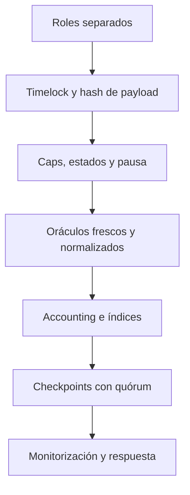

# Modelo de seguridad

## Objetivos

Preservar custodia, impedir creación de deuda sin respaldo suficiente, aislar
precios degradados, limitar cambios de gobierno y mantener evidencia contable
independiente.

## Capas

## Matriz de controles

| Riesgo operativo | Prevención | Detección | Respuesta |
| --- | --- | --- | --- |
| Precio degradado | Edad, rango y fallback | Sentinel y desviación | Congelar mercado |
| Concentración | Caps y LTV | HHI y stress | Reducir caps |
| Utilización extrema | Curva y borrow cap | Reporter de capacidad | Pausar borrow |
| Clave degradada | Roles y multifirma | Eventos de roles | Revocar y rotar |
| Cambio prematuro | Timelock | Operación pendiente | Cancelar con guardian |
| Descuadre contable | Pull exacto e índices | Checkpoint independiente | Pausa y conciliación |
| Reservas insuficientes | Exclusión de liquidez | Coverage monitor | Retener distribución |

## Checkpoints

El digest incluye chain ID, contrato, época, supply, borrow, reservas, roots de
mercado/cuenta y hash anterior. Sólo puede existir una propuesta pendiente. Un
reporter no aprueba dos veces y la reducción del conjunto no puede dejar el
quórum por encima del número de reporters.

## Supuestos

- tokens sin rebases ni fees silenciosas;
- feeds con timestamps coherentes;
- keeper simula sobre un bloque reciente;
- manifestos de red firmados;
- separación real de infraestructura entre roles y reporters.
