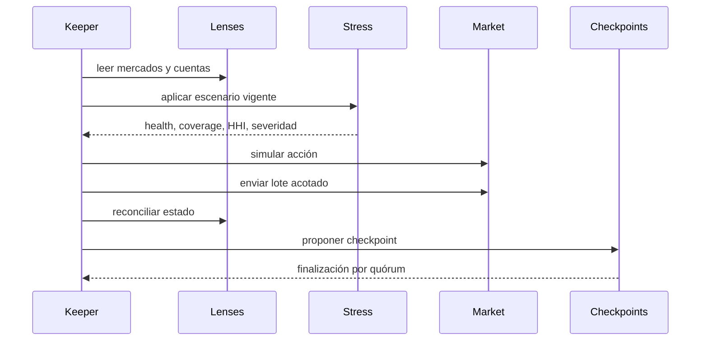

# Operaciones

## Ciclo del keeper

## Checklist previa

- chain ID, direcciones y bytecode coinciden con el manifiesto;
- cash, supply, borrow y reservas reconcilian;
- precios son válidos, frescos y dentro de desviación;
- caps y estado del mercado permiten la acción;
- gas y tamaño del lote respetan el planificador;
- la simulación usa el mismo bloque o uno posterior controlado;
- no existe una operación de gobierno incompatible pendiente.

## Métricas

Utilización, cash neto de reservas, cap usage, índices, edad del accrual, health
por bandas, concentración, desviación de precio, shortfall de stress, timelocks
pendientes y edad del último checkpoint.

## Respuesta

1. Capturar bloque y evidencia antes de actuar.
2. Congelar el mercado afectado o pausar globalmente.
3. Detener jobs dependientes del precio o índice divergente.
4. Conciliar con dos observadores independientes.
5. Preparar cambio o rotación mediante el canal de gobierno.
6. Reanudar sólo tras dos checkpoints consecutivos consistentes.
